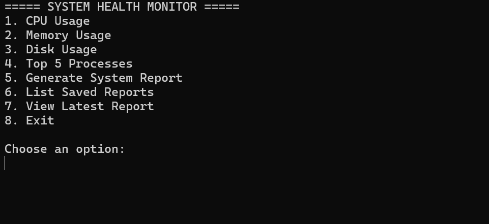
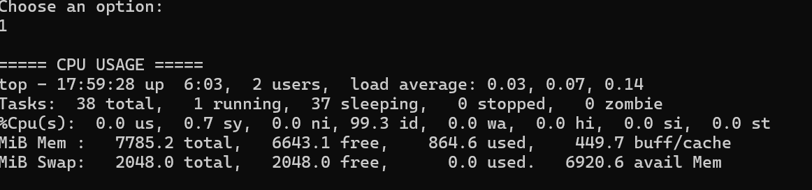
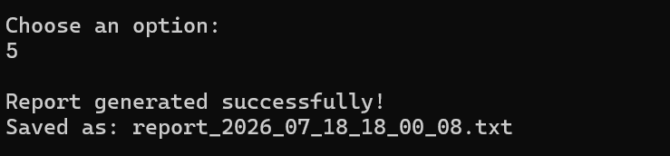

# Linux System Health Monitor

A lightweight, menu-driven Bash application for monitoring the health and performance of Linux systems. This tool provides real-time insights into CPU usage, memory utilization, disk space, running processes, and generates timestamped system reports for future analysis.

---

## 📌 Overview

Linux System Health Monitor is a command-line utility developed using Bash scripting. It simplifies system monitoring by providing an interactive menu that allows users to quickly check important system metrics without remembering multiple Linux commands.

This project demonstrates Linux administration fundamentals, shell scripting, automation, and command-line programming.

---

## ✨ Features

- 📊 Monitor CPU usage
- 💾 Monitor memory utilization
- 📁 Check disk usage
- ⚡ Display top CPU-consuming processes
- 📝 Generate timestamped health reports
- 📂 List all previously generated reports
- 🕒 View the most recent report
- 🎯 Interactive menu-driven interface
- 🚀 Lightweight and easy to use

---

## 🛠️ Technologies Used

- Bash Shell Scripting
- Linux
- Standard Linux Utilities
  - `top`
  - `free`
  - `df`
  - `ps`
  - `date`

---

## 🎯 Skills Demonstrated

- Bash Shell Scripting
- Linux System Administration
- Process Monitoring
- Resource Utilization Analysis
- Report Automation
- Command-Line Interface (CLI)
- File Handling
- Shell Functions
- Menu-driven Programming

---

## 📁 Project Structure

```
Linux-System-Health-Monitor/
│
├── README.md
├── system_monitor.sh
└── assets/
    ├── menu.png
    ├── cpu_usage.png
    └── report.png
```

---

## 🚀 Getting Started

### Clone the Repository

```bash
git clone https://github.com/Karunya0403/linux-system-health-monitor.git
```

### Navigate into the Project

```bash
cd linux-system-health-monitor
```

### Make the Script Executable

```bash
chmod +x system_monitor.sh
```

### Run the Application

```bash
./system_monitor.sh
```

---

## 📋 Menu

```
========== Linux System Health Monitor ==========

1. CPU Usage
2. Memory Usage
3. Disk Usage
4. Top Processes
5. Generate Report
6. List Reports
7. View Latest Report
8. Exit
```

---

## 📄 Sample Report

A generated report includes:

- Current Date & Time
- CPU Usage
- Memory Usage
- Disk Usage
- Top Running Processes

Each report is automatically saved with a timestamp for future reference.

---

## 📸 Screenshots

### Main Menu



### CPU Usage



### Generated Report



## 🔮 Future Enhancements

- Colorized terminal output
- Email notifications
- Scheduled monitoring using cron
- System resource usage graphs
- Log rotation
- Export reports as CSV or PDF

---

## 📜 License

This project is licensed under the MIT License.

---

## 👨‍💻 Author

**Karunya G K**

- GitHub: https://github.com/Karunya0403
- LinkedIn: *(Add your LinkedIn profile URL here)*

---

⭐ If you found this project helpful, consider giving it a star!